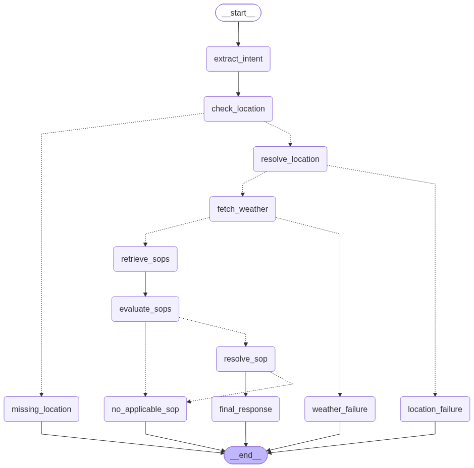
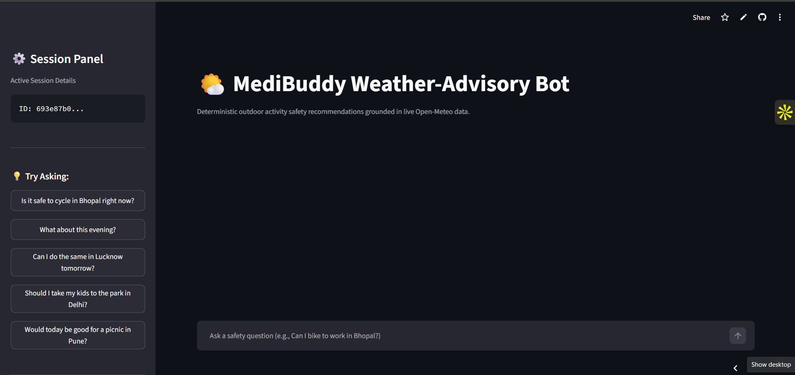

# 🌦️ MediBuddy Weather-Advisory Bot

> **A policy-grounded weather decision system built with LangGraph.**

Real-time weather → deterministic SOP evaluation → grounded recommendation.

> 🌐 **Live Application:** [Launch MediBuddy Weather Advisory Bot](https://weather-bot-medibuddy.streamlit.app/)

### 🛠️ Tech Stack

**LangGraph** · **Groq / openai/gpt-oss-120b** · **Open-Meteo** · **Pydantic** · **Streamlit** · **Python**

---

## 🧠 Architecture

The system is intentionally split into two layers:

- 🤖 **LLM layer** — intent extraction and response wording
- 🛡️ **Deterministic layer** — weather facts, SOP evaluation, conflict resolution

> **The LLM never decides whether an activity is safe.**
> It only extracts intent and verbalizes a decision already made by deterministic policy logic.



### 🖥️ Application



### Execution Pipeline

1. 🤖 **Intent Extraction (`extract_intent`):** Parses the user query into structured attributes (`activity`, `location`, `time_expression`, `vulnerable_group`) using Pydantic schema constraints.

2. 📍 **Location Validation & Geocoding (`check_location`, `resolve_location`):** Resolves city names to coordinates via Open-Meteo Geocoding. If a location is absent or unresolvable, the graph terminates into a clear clarification prompt.

3. 🌦️ **Weather Retrieval (`fetch_weather`):** Queries live and forecasted weather (temperature, wind speed, precipitation, rain probability, UV index) from the Open-Meteo Forecast API. If the upstream API fails, it routes to an honest failure response rather than hallucinating.

4. 🛡️ **Policy Evaluation (`retrieve_sops`, `evaluate_sops`):** Reads definitions freshly from `sops.json` and evaluates boolean and numeric boundary rules against current weather parameters.

5. ⚖️ **Conflict Resolution (`resolve_sop`):** If multiple SOPs match the current conditions, tie-breaking selects the winning policy using strict deterministic precedence:

   $$\text{Severity (critical } > \text{ high } > \text{ medium } > \text{ low)} \longrightarrow \text{Priority (descending)} \longrightarrow \text{SOP ID (ascending)}$$

   If no policy applies, it returns a standard out-of-scope response without inventing rules.

6. 💬 **Constrained Synthesis (`final_response`):** Synthesizes a conversational response citing the exact SOP ID and quoting the real retrieved metrics without altering advice or hallucinating values.

---

## 🎯 Design Principles

| Principle | Implementation |
|---|---|
| LLMs for language | Intent extraction and final response synthesis |
| Deterministic policy | SOP applicability is evaluated with explicit rules |
| Live facts | Weather values always come from Open-Meteo |
| Explicit precedence | Severity → priority → SOP ID |
| Independently managed SOPs | Policies live in `sops.json` |
| No guessing | Missing location, API failures, and no-SOP cases have explicit paths |
| Session memory | LangGraph checkpointing maintains conversation context |

---

## Project Structure

```text
.
├── app/
│   ├── config.py          # Environment settings & API configuration
│   ├── evaluator.py       # Deterministic rule evaluation & tie-breaking logic
│   ├── graph.py           # LangGraph StateGraph topology and node definitions
│   ├── intent.py          # Structured extraction & semantic activity mapping
│   ├── llm.py             # Groq ChatModel client instantiation
│   ├── location.py        # Open-Meteo geocoding interface
│   ├── sop_loader.py      # Dynamic JSON policy ingestion
│   ├── state.py           # Pydantic schemas & AgentState definitions
│   └── weather.py         # Open-Meteo forecast fetching & time targeting
├── evals/
│   ├── eval.py            # Automated 10-point evaluation test suite
│   └── eval_results.json  # Exported test results & verification metrics
├── graph_diagram.png      # Exported architecture visualization
├── requirements.txt       # Production dependencies
├── sops.json              # Canonical safety operating procedures
└── streamlit_app.py       # Interactive Streamlit UI with weather traceability
```

---

## Installation & Setup

### 1. Clone the Repository

```bash
git clone https://github.com/kforkandarp/weather-bot.git
cd weather-bot
```

### 2. Create Virtual Environment

```bash
python -m venv .venv

# Windows (PowerShell)
.venv\Scripts\Activate.ps1

# Linux / macOS
source .venv/bin/activate
```

### 3. Install Dependencies

```bash
pip install -r requirements.txt
```

### 4. Set Environment Variables

Create a `.env` file in the project root:

```
GROQ_API_KEY=your_groq_api_key_here
```

---

## Evaluation Suite

The test suite in `evals/eval.py` verifies both end-to-end conversational paths and isolated deterministic logic across 10 functional criteria:

- **Direct Policy Match (Favorable & Adverse):** Verifies correct SOP assignment under safe conditions (live API) and simulated dangerous conditions (deterministic evaluation).

- **Paraphrased Intent:** Checks if the bot understands everyday slang and phrasing (like "light stroll" or "scooty ride") and correctly matches them to standard activities like "walking" or "commuting," even without the exact words.

- **Live API Grounding:** Confirms temperature, wind speed, and precipitation values quoted in the text directly match live Open-Meteo telemetry.

- **Out of Scope Handling:** Validates that unsupported activities return a clean refusal rather than fabricating safety advice.

- **Failure Resilience:** Simulates upstream API connectivity failures to verify graceful recovery without crashing.

- **Conflict Resolution:** Evaluates edge cases where multiple SOPs match simultaneously, verifying that critical severity and higher priority take precedence.

- **Adversarial Resilience:** Tests prompt injection attempts designed to bypass SOPs or declare dangerous conditions safe.

### Running Evaluations

```bash
python evals/eval.py
```

Test results and summary statistics are automatically saved to `evals/eval_results.json`.

### Running the Application

To launch the local web interface:

```bash
streamlit run streamlit_app.py
```

The interface includes a multi-turn conversational chat and a Policy & Weather Traceability panel displaying parsed intent, resolved coordinates, live metrics, and matched policy criteria.